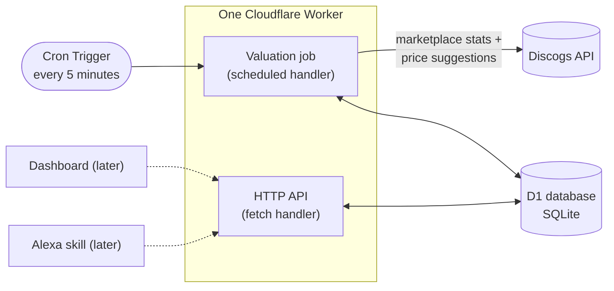

# Vinyl Value Vault

[](https://github.com/JakubMini/vinyl-value-vault/actions/workflows/ci.yml)

A small serverless backend that keeps a record of every vinyl I own, asks the market what each one is worth, and always knows what the whole collection is worth. Built on Cloudflare Workers and D1, priced from Discogs, designed to run for free.

> **Status:** backend built and tested locally. Not yet deployed. See the [roadmap](#roadmap).

## What it does

- **Keeps the collection.** Each record is stored once: artist, title, pressing details (label, catalogue number, year, country, format), the condition of the disc and the sleeve, and what I paid for it. Adding a record can be as little as its Discogs release id; the rest is filled in from Discogs.
- **Keeps the prices fresh.** Every five minutes a scheduled job takes the records that have gone longest without a price and asks Discogs what they are worth today. Every valuation is kept, so each record and the collection as a whole have a price history.
- **Answers one question quickly.** "What is my collection worth?" is a single query, with the number of records priced, the number still waiting, and when the last price came in.
- **Exposes a small JSON API** so a dashboard, a script, or a voice assistant can add records and ask about them.

## How it works



One Worker, two entry points. The `fetch` handler serves the API; the `scheduled` handler runs the valuation job. Both reach the same D1 database through a binding, so there is no connection string, no server to keep alive, and nothing running between requests.

### How a record gets its price

Discogs is the reference market for records and offers two useful numbers for any pressing:

1. **Price suggestions**: what a copy in each condition grade typically sells for. This is the headline value, matched to the grade I recorded for my own copy. It needs an API token and seller settings on the Discogs account.
2. **Marketplace stats**: the cheapest copy listed right now and how many are for sale. Always available, and the fallback when suggestions are not.

Which of the two produced a value is stored with every valuation, so the figures are never mixed up. If nothing is for sale and Discogs has no suggestion, the record keeps its last value and the reason is written on it, visible in the API.

### Designed for the free tier

The Workers free plan allows 50 outbound requests and 10 ms of CPU per invocation. Discogs allows 60 requests a minute. Rather than one big nightly run that would break both limits, the job runs every five minutes on the 20 records that have waited longest, two Discogs calls each. That is about 5,700 refreshes a day, so a collection of a thousand records is fully repriced daily with room to spare. The job reads Discogs' rate-limit headers and stops early instead of being throttled; whatever it did not reach waits for the next run. Time spent waiting on Discogs does not count as CPU time, so the 10 ms budget is not a concern.

Expected running cost at this scale: nothing.

## The stack, and why

| Piece | Choice | Why |
| --- | --- | --- |
| Runtime | [Cloudflare Workers](https://developers.cloudflare.com/workers/) | Serverless, globally deployed, generous free tier, and the cron, database and HTTP surface come from one platform. |
| Database | [D1](https://developers.cloudflare.com/d1/) | A hosted SQLite database with migrations and a binding straight into the Worker. Right-sized for a personal collection. |
| Scheduling | [Cron Triggers](https://developers.cloudflare.com/workers/configuration/cron-triggers/) | A line of config, no scheduler to run. |
| HTTP | [Hono](https://hono.dev/) | A small, fast, well-typed router built for the Workers runtime. |
| Validation | [Zod](https://zod.dev/) | Every request body and query string is checked before it touches the database. |
| Language | TypeScript, strict | Binding types are generated from the Wrangler config, so a typo in a binding name fails the build, not production. |
| Tests | [Vitest](https://vitest.dev/) with Cloudflare's plugin | Tests run inside the real Workers runtime against a real local D1 with migrations applied. Discogs is mocked at the network layer with [Mock Service Worker](https://mswjs.io/). |
| CI | GitHub Actions | Types, typecheck, tests and a dry-run deploy on every pull request. |

## Data model

Three tables. Money is stored as integers in minor units (pence) so there is no floating-point drift. Times are ISO-8601 UTC strings. Condition uses the Goldmine scale collectors use: M, NM, VG+, VG, G+, G, F, P.

| Table | One row per | Notes |
| --- | --- | --- |
| `records` | record in the collection | Carries the current value and when it was last looked at, so listing and totalling need no joins. |
| `valuations` | price fetched for a record | Append-only history, with the method used and the raw Discogs payload for re-deriving later. |
| `collection_snapshots` | valuation run that changed something | The collection total over time, ready to chart. |

The schema is in [`migrations/0001_init.sql`](migrations/0001_init.sql).

## API

Every route except `/health` requires `Authorization: Bearer <API_KEY>`. Responses are JSON. Amounts are in minor units, with a formatted string alongside where it helps.

| Method and path | What it does |
| --- | --- |
| `GET /health` | Liveness check. No key needed. |
| `GET /collection` | Total value, record counts, when the last price arrived, and the last 30 snapshots. |
| `GET /records?limit=&offset=` | The collection, alphabetical. |
| `POST /records` | Add a record. Give a `discogs_release_id` alone, or `artist` and `title`. Priced immediately when it has a Discogs id. |
| `GET /records/:id` | One record with its valuation history. |
| `PATCH /records/:id` | Change any field a client may set. |
| `DELETE /records/:id` | Remove a record and its history. |
| `POST /records/:id/revalue` | Price one record now. |
| `POST /valuations/run?limit=` | Run a valuation batch now. The cron does exactly this. |
| `GET /snapshots?limit=` | The collection total over time. |

Adding a record by its Discogs id:

```bash
curl -s -X POST http://localhost:8787/records \
  -H "Authorization: Bearer $API_KEY" \
  -H "content-type: application/json" \
  -d '{"discogs_release_id": 249504, "media_condition": "VG+", "sleeve_condition": "VG", "purchase_price_minor": 1800, "purchase_currency": "GBP"}'
```

```json
{
  "id": 1,
  "discogs_release_id": 249504,
  "artist": "Nirvana",
  "title": "Nevermind",
  "label": "DGC",
  "catalogue_number": "DGC 24425",
  "year": 1991,
  "format": "LP, Album",
  "media_condition": "VG+",
  "sleeve_condition": "VG",
  "purchase_price_minor": 1800,
  "current_value_minor": 2500,
  "current_currency": "GBP",
  "current_value": "£25.00",
  "last_valued_at": "2026-10-02T09:00:00.000Z",
  "last_valuation_error": null
}
```

## Running it locally

You need Node 24 or newer. Nothing else is installed on your machine; the Worker and its database run in a local sandbox.

```bash
npm install
cp .dev.vars.example .dev.vars      # then set API_KEY, and DISCOGS_TOKEN if you have one
npm run db:migrate:local
npm run dev
```

The API is at `http://localhost:8787`. The dev server runs with `--test-scheduled`, so the cron handler can be fired by hand:

```bash
curl http://localhost:8787/__scheduled
```

Checks before pushing:

```bash
npm run check      # regenerate binding types, typecheck, run the tests
```

## Deploying

A one-time setup on a Cloudflare account, free plan is enough:

```bash
npx wrangler login
npx wrangler deploy                 # first run creates the D1 database and writes its id into wrangler.jsonc
npm run db:migrate:remote
npx wrangler secret put API_KEY
npx wrangler secret put DISCOGS_TOKEN
```

After that, `npm run deploy` ships a new version. `npx wrangler tail` streams the structured logs, including a summary line from every valuation run.

## How I work on this

- **Nothing lands on `main` directly.** Every change, however small, is a branch and a pull request. CI must pass before merging.
- **Tests run in the real runtime.** The suite spins up the Worker in workerd with a fresh D1, applies the migrations, and exercises the API and the scheduled job end to end. Discogs is mocked at the fetch layer, so the tests are fast, deterministic and never touch the network.
- **Migrations are append-only.** The schema changes by adding numbered files, never by editing one that has been applied.
- **Secrets never enter the repo.** `.dev.vars` locally, `wrangler secret put` in production, and the secret names are typed so a missing one fails closed.
- **This README is kept true.** A change to the architecture, API, setup or roadmap updates it in the same pull request.
- **AI-assisted.** I build this with Claude Code as a pair programmer. The design decisions, reviews and merges are mine.

## Project layout

```
src/
  index.ts       Worker entry: fetch -> the API, scheduled -> the valuation job
  app.ts         HTTP routes, validation, authentication
  valuation.ts   the job: pick stale records, price them, snapshot the total
  discogs.ts     Discogs API client and release-to-record mapping
  db.ts          every SQL statement, typed
  grades.ts      Goldmine grades and their Discogs labels
  money.ts       minor-unit helpers
migrations/      D1 schema, numbered and append-only
test/            Vitest suites running inside workerd
wrangler.jsonc   Worker config: bindings, vars, cron
```

## Roadmap

- [x] Schema, API, valuation job, tests and CI
- [ ] First deployment, and importing my actual collection
- [ ] Dashboard: add records, see the total and its trend
- [ ] Alexa skill: "what is my collection worth?"
- [ ] Gain and loss against purchase price, per record and overall

## Licence

No licence yet, all rights reserved. Feel free to read and learn from it; ask before reusing.
