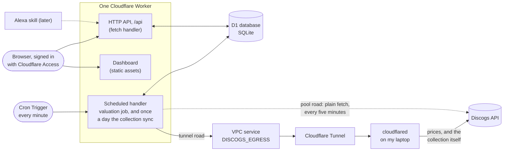

# Vinyl Value Vault

[](https://github.com/JakubMini/vinyl-value-vault/actions/workflows/ci.yml)

A small serverless app that keeps a record of every vinyl I own, asks the market what each one is worth, and always knows what the whole collection is worth. Built on Cloudflare Workers and D1, priced from Discogs, with a React dashboard served by the same Worker, designed to run for free.

> **Status:** live on Cloudflare since 2 October 2026, behind a Cloudflare Access login. My collection, 163 records, is in, and syncs from Discogs daily. Discogs calls leave through a Cloudflare Tunnel from my laptop, because from Cloudflare's shared address Discogs mostly says no (see [The road to Discogs](#the-road-to-discogs)), so prices refresh while the laptop is awake. Since 2 October 2026 the Discogs account has seller settings, so each daily refresh prices a record at Discogs' suggestion for its grade, not the cheapest copy for sale. Every record is still on the default grade, VG+, until I grade them. The dashboard is built, deployed and in use (see [Who can get in](#who-can-get-in)).

## What it does

- **Keeps the collection.** Each record is stored once: artist, title, pressing details (label, catalogue number, year, country, format), the condition of the disc and the sleeve, and what I paid for it. Adding a record can be as little as its Discogs release id; the rest is filled in from Discogs.
- **Follows the Discogs collection.** Once a day, or on demand, the vault syncs with my Discogs collection: new records arrive with the grades I gave them there, pressing details and cover art stay current, and records that leave the collection are flagged rather than deleted, so their price history survives.
- **Keeps the prices fresh.** Every minute a scheduled job takes up to 15 records whose price is more than a day old and asks Discogs what they are worth today, by way of my laptop. Every valuation is kept, so each record and the collection as a whole have a price history.
- **Answers one question quickly.** "What is my collection worth?" is a single query, with the number of records priced, the number still waiting, and when the last price came in.
- **Has a dashboard.** A web app served by the same Worker, behind a Cloudflare Access login. It shows what the collection is worth and how that has moved over 30 days, 90 days, a year or all time, the records that have risen or fallen most, and the gain on what I paid. It lists the whole collection in a table that sorts and searches, and narrows by status, grade, decade, format, number of discs, pressing (compilation, reissue, mono...), label, sleeve, value, Spotify and price paid, with quick views such as most valuable, biggest risers and needs a price. Whatever is shown is added up: what it is worth, how that moved in 30 days, the gain on what was paid. Every filter is in the URL, so a view can be bookmarked. I can grade each record in place, re-price the records I tick (or all of them: "revalue every 1970s LP" is a filter, a tick and a button), and run or preview a sync with Discogs. Each record has its own page: its price history as a chart and a table, Discogs' price at every grade, and what I paid and when.
- **Plays it.** A record can be pinned to its album on Spotify by pasting the album's link; its page then plays it in Spotify's embedded player, and the table links straight to it. Unpinned records get a Spotify search link. There is no Spotify API involved: since February 2026 Spotify only gives API access to hobby apps run from a Premium account, and a pasted link is all a personal collection needs.
- **Exposes a small JSON API** so the dashboard, a script, or a voice assistant can add records and ask about them.

## How it works



One Worker, two entry points. The `fetch` handler serves the API; the `scheduled` handler runs the valuation job, and once a day the collection sync in its place. Both reach the same D1 database through a binding, so there is no connection string, no server to keep alive, and nothing running between requests. Calls to Discogs normally leave through a Cloudflare Tunnel from my laptop rather than straight from the Worker; [The road to Discogs](#the-road-to-discogs) says why.

The dashboard is a React app that Vite builds into static files, deployed with the Worker. Cloudflare serves those files without running the Worker at all, so page loads are free and unmetered; only `/api/*` reaches the code. Any other path gets the app's `index.html`, so a link to a page inside the dashboard still works after a reload. One origin for the app and the API means no CORS.

### How a record gets its price

Discogs is the reference market for records and offers two useful numbers for any pressing:

1. **Price suggestions**: a price for a copy in each condition grade. Discogs estimates what a Mint copy is worth from the release's sales history and current listings, then scales that down grade by grade. This is the headline value, matched to the grade I recorded for my own copy. It needs an API token and seller settings on the Discogs account, and it comes in the account's selling currency, which must be the vault's (GBP).
2. **Marketplace stats**: the cheapest copy listed right now and how many are for sale. Always available, and the fallback when there is no suggestion to use.

The cheapest listing is a rough figure. It is what one seller is asking, for a copy in any grade, and it misses in both directions. Before the account had seller settings, every price came from it: one record in demand, with six copies listed, was valued about 50% above its median sale, and a common record with 245 copies listed was valued at 10p.

Which of the two produced a value is stored with every valuation, so the figures are never mixed up. When the value is the cheapest listing, the record page says why: the account gets no suggestions, they are in another currency, or Discogs has too few sales of that release to suggest a price. If nothing is for sale and Discogs has no suggestion, the record keeps its last value and the reason is written on it, visible in the API.

The Discogs website also shows the lowest, median and highest price of recent sales, which is the closest thing to a true market value. The API does not offer it, and the page needs a login, so the vault cannot read it. Other sources were considered and left out. eBay's sold-price API is open only to developers eBay approves. Its open API has asking prices only, without Goldmine grades, and barcodes are often shared between pressings. Popsike, MusicStack and CDandLP have no public API.

Changing a record's grade re-prices it at once, without calling Discogs: every stored valuation keeps Discogs' suggestions for all eight grades, so the new value is read from the latest one and recorded as a regrade. The record then goes to the front of the queue, and the next run confirms the price with fresh data. When the price came from the cheapest listing, which does not depend on grade, the value stays as it is.

Re-pricing on request works through the same queue. Ticking records in the collection table (or none, for every record shown) and choosing Revalue sends them to the front, alongside records not yet priced. Nothing is priced in that request: 163 records would mean over 300 Discogs calls, far past the 50 a Worker may make in one invocation. The valuation job takes them a batch at a time, and the table refreshes once a minute until they are done.

### Staying in step with the Discogs collection

My records are catalogued on Discogs, so that is where the collection lives. The vault syncs with it rather than asking me to enter anything twice.

The rule that keeps this simple is who owns what. **Discogs owns what a pressing is**: artist, title, label, year, format, cover art. **The vault owns what I say about my copy**: its grades, notes and what I paid. A sync adds new items, taking whatever grades Discogs has for them, and refreshes the Discogs-owned details of items already here. It never overwrites a grade or a note set in the vault.

- **Removals are flagged, not deleted.** A record that has left the collection keeps its price history but drops out of the total and the valuation queue. If it comes back, the flag clears.
- **Deleting is deliberate.** A record deleted from the vault is remembered, so the next sync does not bring it back.
- **A bad answer cannot empty the vault.** Removals are only decided after every page has been read. If a sync would flag more than a fifth of the collection, it stops and asks for confirmation.
- **Nothing is written twice.** The sync reads the vault's Discogs-linked records once, works out what is new or changed in memory, and writes each page of up to 100 items in two statements.

### Designed for the free tier

The Workers free plan allows 50 outbound requests and 10 ms of CPU per invocation. Discogs allows 60 requests a minute, counted per source IP.

That second limit turned out to be the real constraint. Discogs' API sits behind Cloudflare, and when a Worker calls a site hosted on another Cloudflare account, Cloudflare gives the request one fixed client address, `2a06:98c0:3600::103` ([Cloudflare's header reference](https://developers.cloudflare.com/fundamentals/reference/http-headers/)). So to Discogs, every Worker on Cloudflare, from every customer, is a single caller with a single allowance of 60 requests a minute. The vault gets whatever is left. On 2 October 2026 most minutes got a 429 on their first call, while the same code on a laptop synced the whole collection in four calls.

So the vault's Discogs calls take another road, from an address of their own: see [The road to Discogs](#the-road-to-discogs). Whichever road they take, the job stays inside both limits:

- **Sized to the road.** On the tunnel road a run prices up to 15 records. A run costs 3 subrequests (two reads and the snapshot) and each record up to 3 (two Discogs calls and one write), so 15 records stay under the 50 a run may make, at no more than 30 Discogs calls a minute. On the pool road a run every five minutes prices up to 5.
- **Only what is due.** A record priced in the last 24 hours is skipped. Once the collection is fresh the job makes no Discogs calls at all, and each record costs one or two calls a day.
- **No wasted calls.** If Discogs says the account cannot get price suggestions, or gives them in another currency, the job stops asking for the rest of the batch, uses listing prices, and says why in its log line (`suggestionsSkipped`).
- **Polite under pressure.** It reads Discogs' rate-limit headers and stops early instead of being throttled. Whatever it did not reach waits for the next run.
- **The sync takes its own run.** Once a day the cron syncs the collection instead of pricing records: two calls, plus one per 100 items. A sync that fails or is cut short is retried an hour later, so valuations never wait on it for long.

On the tunnel road that is up to 21,600 record prices a day, and the whole collection takes 11 minutes. Time spent waiting on Discogs does not count as CPU time, so the 10 ms budget is not a concern.

The database has a budget too: the free plan allows 5 million D1 rows read a day. The dashboard is built to stay far inside it. The collection list reads about three rows per record, using indexes (once a minute while records are queued for a price, and only while the page is in view), and the value chart reads one row per day from a small daily table rather than every snapshot the job writes.

Expected running cost at this scale: nothing. Cloudflare Tunnel is free, and Workers VPC is free on every plan while it is in beta.

### The road to Discogs

Discogs counts requests by address, so the fix is to call it from an address the vault does not share. Calls take one of two roads, chosen by one setting, `DISCOGS_ROAD`:

| Road | How calls leave | Discogs sees | Runs | Records per run |
| --- | --- | --- | --- | --- |
| `tunnel` | The Workers VPC service `DISCOGS_EGRESS`, through the Cloudflare Tunnel `vinyl-vault-egress`, out of `cloudflared` on my laptop | My home address, with the whole allowance | Every minute | 15 |
| `pool`, the default | A plain `fetch` from the Worker | `2a06:98c0:3600::103`, shared with every Worker | Every five minutes | 5 |

I measured both on 2 October 2026. Through the tunnel, Discogs saw the laptop's address on every call, answered 200, and counted the calls 0, 1, 2. In the same seconds the plain road got a 429 every time, with 60 to 65 calls already counted against the shared address.

The laptop only needs to be awake about 11 minutes a day: 163 records at 15 a minute, and a minute for the sync. While it sleeps the tunnel has no connector, so a call fails at once. The job treats that as "try again next minute": no record is marked as failed, and the dashboard and API carry on with the last prices.

Other ways out, and why not:

- **Cloudflare Gateway egress** (a `cf1:network` binding) also gets past the shared address, but each call leaves from a different address, so Discogs cannot count the vault as one client. Discogs' terms warn against getting around the limit, and the account at stake holds my collection.
- **GitHub Actions** would cost nothing on this public repo, but GitHub's terms rule out using Actions as part of a running service.
- **A free cloud VM** can run the connector instead of the laptop. Oracle's Always Free micro VM is the one that is free with no end date and has its own address; it needs a card at sign-up, and Oracle reclaims VMs that sit idle. Google's free VM charges for its public IPv4 address.

#### Switching roads

`DISCOGS_ROAD` is a Worker secret. It is not secret, but a secret survives deploys: a script can change it without deploying, and a deploy cannot change it back. Four commands manage it, each checking first that wrangler is on the vault's Cloudflare account:

```bash
npm run egress:here     # make this machine the way out, and put the vault on the tunnel road
npm run egress:pool     # back to the shared address, a run every five minutes
npm run egress:status   # which road the vault is on, and which machines the tunnel has
npm run egress:remove   # on a laptop being retired: stop being the way out
```

`egress:here` installs `cloudflared` with Homebrew if it is missing, fetches the tunnel's connector token through the Cloudflare API, and keeps it in `~/Library/Application Support/vinyl-value-vault/tunnel-token`, readable only by me. It runs `cloudflared` as a launchd agent, so it starts at login and restarts if it stops (log: `~/Library/Logs/vinyl-value-vault-egress.log`). Then it sets `DISCOGS_ROAD=tunnel` and watches the next run to confirm it went through. `egress:pool` sets the road back and removes this machine's connector.

**Moving to a new laptop:** clone the repo, `npm install`, `npx wrangler login`, and `npm run egress:here`. Then run `npm run egress:remove` on the old one. While both are connected, Cloudflare splits the calls between two addresses, which `egress:here` warns about.

**What the laptop can see:** `cloudflared` makes the HTTPS connection to Discogs itself, so it sees the vault's Discogs requests, token included. That is fine on my own laptop, and it is why the connector token stays private: whoever holds it could stand in as the way out.

#### Setting up the road from scratch

This was done once, on 2 October 2026:

```bash
npx wrangler tunnel create vinyl-vault-egress
npx wrangler vpc service create discogs-api --type http --tunnel-id <tunnel id> --hostname api.discogs.com
# put the service id in wrangler.jsonc (vpc_services, binding DISCOGS_EGRESS), deploy, then:
npm run egress:here
```

If a laptop that held the token is lost, make the token worthless: delete the tunnel, create it again, and point the same VPC service at the new one. The service id does not change, so `wrangler.jsonc` stays as it is.

```bash
npx wrangler tunnel delete vinyl-vault-egress
npx wrangler tunnel create vinyl-vault-egress
npx wrangler vpc service update <service id> --name discogs-api --type http --tunnel-id <new tunnel id> --hostname api.discogs.com
npm run egress:here
```

## The stack, and why

| Piece | Choice | Why |
| --- | --- | --- |
| Runtime | [Cloudflare Workers](https://developers.cloudflare.com/workers/) | Serverless, globally deployed, generous free tier, and the cron, database and HTTP surface come from one platform. |
| Database | [D1](https://developers.cloudflare.com/d1/) | A hosted SQLite database with migrations and a binding straight into the Worker. Right-sized for a personal collection. |
| Scheduling | [Cron Triggers](https://developers.cloudflare.com/workers/configuration/cron-triggers/) | A line of config, no scheduler to run. |
| Way out to Discogs | [Cloudflare Tunnel](https://developers.cloudflare.com/tunnel/) and [Workers VPC](https://developers.cloudflare.com/workers-vpc/) (beta) | Lets the Worker's Discogs calls leave from my laptop's address, with nothing on the laptop open to the internet: the connector only dials out. The Worker keeps all the logic; only the road changes. |
| Dashboard | [React](https://react.dev/) + [Vite](https://vite.dev/), on [Workers Static Assets](https://developers.cloudflare.com/workers/static-assets/) | One deploy and one origin with the API. Cloudflare's Vite plugin runs the Worker in the real runtime during development, next to the app. [TanStack Query](https://tanstack.com/query) handles fetching and caching; styling is plain CSS with light and dark tokens. Charts are drawn as plain SVG by one small component rather than a charting library. |
| HTTP | [Hono](https://hono.dev/) | A small, fast, well-typed router built for the Workers runtime. |
| Sign-in | [Cloudflare Access](https://developers.cloudflare.com/cloudflare-one/policies/access/) | A login page for the dashboard without writing one, free for a personal project. The Worker verifies Access's signed token itself, so a misconfiguration locks the door rather than opening it. |
| Validation | [Zod](https://zod.dev/) | Every request body and query string is checked before it touches the database. |
| Language | TypeScript, strict | Binding types are generated from the Wrangler config, so a typo in a binding name fails the build, not production. |
| Tests | [Vitest](https://vitest.dev/) with Cloudflare's plugin | Tests run inside the real Workers runtime against a real local D1 with migrations applied. Discogs is mocked at the network layer with [Mock Service Worker](https://mswjs.io/). |
| CI | GitHub Actions | Types, typecheck, tests and a dry-run deploy on every pull request. |

## Data model

Six tables. Money is stored as integers in minor units (pence) so there is no floating-point drift. Times are ISO-8601 UTC strings. Condition uses the Goldmine scale collectors use: M, NM, VG+, VG, G+, G, F, P.

| Table | One row per | Notes |
| --- | --- | --- |
| `records` | record in the collection | Carries the current value and when it was last looked at, so listing and totalling need no joins. Records from Discogs remember their collection item, which is unique, so a sync can never duplicate a record. Also holds cover art URLs, a flag for records that have left the Discogs collection, and the Spotify album a record is pinned to. |
| `valuations` | price fetched for a record | Append-only history, with the method used, the grade the price was for, and the raw Discogs payload for re-deriving later (a regrade does exactly that). |
| `collection_snapshots` | valuation run that changed something | The collection total after every run, roughly one a minute while prices are being refreshed. |
| `collection_daily` | day | The last total of each day, kept current by the job. What the chart reads. |
| `sync_runs` | collection sync | What each sync added, refreshed and flagged, and why one stopped early. Also how the cron knows when the next sync is due. |
| `sync_ignored` | record deleted on purpose | Discogs collection items the sync must not bring back. |

The schema is in [`migrations/`](migrations/), one numbered file per change.

## API

Every route lives under `/api`, which leaves the rest of the hostname free for the dashboard. Every route except `/api/health` needs a credential: the API key as `Authorization: Bearer <API_KEY>`, or a Cloudflare Access login (see [Who can get in](#who-can-get-in)). Responses are JSON. Amounts are in minor units, with a formatted string alongside where it helps.

| Method and path | What it does |
| --- | --- |
| `GET /api/health` | Liveness check. No key needed. |
| `GET /api/collection?days=` | Total value, record counts, when the last price arrived, and one total per day for the last `days` days (30 by default, up to ten years), oldest first. |
| `GET /api/records?limit=&offset=` | The collection, alphabetical, up to 1,000 a page. Each record carries its change over 30 days and its gain against what I paid (when both are in the same currency). |
| `POST /api/records` | Add a record. Give a `discogs_release_id` alone, or `artist` and `title`. Priced immediately when it has a Discogs id, unless `?value=false` leaves it to the cron. A repeated `discogs_instance_id` gets a 409. |
| `GET /api/records/:id?limit=` | One record with its price history, newest first (a year by default, up to 1,000 prices), Discogs' suggested price at every grade from the latest price, whether that price had a suggestion to go on (`suggestions`: `available`, `unavailable`, `no_data` or `wrong_currency`), and a link to the release on Discogs. |
| `PATCH /api/records/:id` | Change any field a client may set. A new media grade re-prices the record from the stored Discogs suggestions and queues it for a fresh price. `spotify_album_id` takes an album link, a `spotify:album:` URI or a bare id, and stores the id. |
| `DELETE /api/records/:id` | Remove a record and its history. A record from the Discogs collection is remembered, so a sync does not bring it back. |
| `POST /api/records/:id/revalue` | Price one record now. |
| `POST /api/valuations/run?limit=` | Run a valuation batch now. The cron does exactly this. |
| `POST /api/valuations/queue` | Send records to the front of the valuation queue, even if they were priced recently: `{"ids": [1, 2, 3]}`, up to 1,000. Records without a Discogs release, or gone from the collection, are left out. Answers how many were queued. |
| `GET /api/snapshots?limit=` | The collection total over time. |
| `POST /api/sync/discogs` | Sync with the Discogs collection now. `?dry_run=true` reports what would change without writing; `?force_removals=true` confirms a large removal. Answers 502 if Discogs refused. |
| `GET /api/sync/runs?limit=` | Recent syncs, newest first. |

Adding a record by its Discogs id:

```bash
curl -s -X POST http://localhost:8787/api/records \
  -H "Authorization: Bearer $API_KEY" \
  -H "content-type: application/json" \
  -d '{"discogs_release_id": 249504, "media_condition": "VG+", "sleeve_condition": "VG", "purchase_price_minor": 1800, "purchase_currency": "GBP"}'
```

```json
{
  "id": 1,
  "discogs_release_id": 249504,
  "artist": "Nirvana",
  "title": "Nevermind",
  "label": "DGC",
  "catalogue_number": "DGC 24425",
  "year": 1991,
  "format": "LP, Album",
  "media_condition": "VG+",
  "sleeve_condition": "VG",
  "purchase_price_minor": 1800,
  "current_value_minor": 2500,
  "current_currency": "GBP",
  "current_value": "£25.00",
  "last_valued_at": "2026-10-02T09:00:00.000Z",
  "last_valuation_error": null
}
```

## Who can get in

Two kinds of caller, two credentials. Everything except `/api/health` needs one of them.

- **Me, in a browser.** The dashboard sits behind Cloudflare Access. Before a request reaches the Worker, Access asks me to log in, then attaches a signed token to every request. The Worker checks that token itself: the signature against the team's published keys, the issuer, the application it was issued for, and its expiry. A header on its own proves nothing.
- **Scripts and tests.** `Authorization: Bearer <API_KEY>`, compared in constant time. A script calling through Access also sends an Access service token (`CF-Access-Client-Id` and `CF-Access-Client-Secret`).

Setting Access up, once:

1. In the Cloudflare dashboard (the personal account): Workers & Pages → vinyl-value-vault → Settings → Domains & Routes → enable Cloudflare Access, for workers.dev and for Preview URLs. The Zero Trust free plan covers up to 50 users, though signing up asks for a payment method.
2. In Zero Trust → Access → Applications, open the application it created. Its policy lets in members of my Cloudflare account, which is only me. Copy its Application Audience (AUD) tag.
3. Set `ACCESS_TEAM_DOMAIN` (`https://<team>.cloudflareaccess.com`) and `ACCESS_AUD` in `wrangler.jsonc`, and deploy. While either is empty, the Worker refuses every Access token and only the API key works.
4. For scripts, create a service token under Zero Trust → Access → Service Auth and allow it in the application's policies.

Access is on, with both values set in `wrangler.jsonc`. Every path, `/api/health` included, is behind the login; a request without an Access session is sent to the login page before it reaches the Worker.

## Running it locally

You need Node 24 or newer. Nothing else is installed on your machine; the Worker and its database run in a local sandbox.

```bash
npm install
cp .dev.vars.example .dev.vars      # then set API_KEY, and DISCOGS_TOKEN if you have one
echo "VITE_DEV_API_KEY=<the same API_KEY>" > .env.development.local
npm run db:migrate:local
npm run dev
```

The dashboard is at `http://localhost:5173` and the API at `http://localhost:5173/api`. There is no Cloudflare Access locally, so in development the dashboard sends the API key from `.env.development.local`; Vite reads that file only in development, so the key never reaches a production build. Locally `DISCOGS_ROAD` is unset, so the vault takes the pool road: a plain `fetch`, which from your machine reaches Discogs from your own address, and a run on every fifth minute. The cron handler can be fired by hand:

```bash
curl http://localhost:5173/cdn-cgi/local/scheduled
```

Checks before pushing:

```bash
npm run check      # regenerate binding types, typecheck, run the tests
```

## Syncing the Discogs collection

The cron does this once a day on its own. To sync now, or to preview first, use the dashboard's Sync page. From a script, the request has to get through Access first, so it also carries a service token:

```bash
curl -s -X POST "https://vinyl-value-vault.jakub-m-szypicyn.workers.dev/api/sync/discogs?dry_run=true" \
  -H "CF-Access-Client-Id: $CF_ACCESS_CLIENT_ID" \
  -H "CF-Access-Client-Secret: $CF_ACCESS_CLIENT_SECRET"
```

The Worker uses `DISCOGS_TOKEN` to find the Discogs account behind it, pages through its collection, keeps the vinyl, and maps each item to a record: pressing details and cover art from Discogs, condition grades from the collection's Media and Sleeve Condition fields where they are filled in, and the collection's notes. A sleeve marked Generic or No Cover has no grade, so it goes into the notes.

New records arrive without a price. Pricing a few hundred records at once would mean a burst of Discogs calls; instead the cron prices them a batch at a time, every minute on the tunnel road, until all are done.

## Deploying

This is what the first deploy looked like, on the free plan:

```bash
npx wrangler login
npx wrangler deploy                 # the first run also created the D1 database; its id is pinned in wrangler.jsonc
npm run db:migrate:remote
npx wrangler secret put API_KEY
npx wrangler secret put DISCOGS_TOKEN
```

The tunnel road came later: see [Setting up the road from scratch](#setting-up-the-road-from-scratch).

After that, `npm run deploy` builds the dashboard and the Worker with Vite and ships both. `npx wrangler tail` streams the structured logs, including a summary line from every valuation run and sync, with the road it took.

## How I work on this

- **Nothing lands on `main` directly.** Every change, however small, is a branch and a pull request. CI must pass before merging.
- **Tests run in the real runtime.** The suite spins up the Worker in workerd with a fresh D1, applies the migrations, and exercises the API and the scheduled job end to end. Discogs is mocked at the fetch layer, so the tests are fast, deterministic and never touch the network.
- **Migrations are append-only.** The schema changes by adding numbered files, never by editing one that has been applied.
- **Secrets never enter the repo.** `.dev.vars` locally, `wrangler secret put` in production, and the secret names are typed so a missing one fails closed.
- **This README is kept true.** A change to the architecture, API, setup or roadmap updates it in the same pull request.
- **AI-assisted.** I build this with Claude Code as a pair programmer. The design decisions, reviews and merges are mine.

## Project layout

```
index.html       the dashboard's page; Vite builds it with web/ into static assets
web/             the dashboard: React pages, the API client, styles
public/          files served as they are: icon, security headers
src/
  index.ts       Worker entry: fetch -> the API, scheduled -> the valuation job or the daily sync
  app.ts         HTTP routes, validation, authentication
  access.ts      checking Cloudflare Access sign-in tokens
  valuation.ts   the job: pick stale records, price them, snapshot the total
  sync.ts        the Discogs collection sync: add, refresh, flag what has gone
  spotify.ts     reading a Spotify album from a pasted link; Spotify URLs (shared with the dashboard)
  select.ts      choosing records: search, filters, sort order and the URL they live in (shared with the dashboard)
  discogs.ts     Discogs API client
  release.ts     Discogs release and collection item -> record mapping
  db.ts          every SQL statement, typed
  grades.ts      Goldmine grades and their Discogs labels
  money.ts       minor-unit helpers
  api-types.ts   response shapes shared by the API and the dashboard
scripts/
  egress.ts      the road to Discogs: this laptop as the way out, or back to the pool
migrations/      D1 schema, numbered and append-only
test/            Vitest suites running inside workerd
wrangler.jsonc   Worker config: bindings (D1, the VPC service), vars, cron, static assets
vite.config.ts   one build for the dashboard and the Worker
```

## Roadmap

- [x] Schema, API, valuation job, tests and CI
- [x] First deployment
- [x] Import my actual collection, and keep it in sync with Discogs
- [x] Dashboard, first step: the total, and syncing with Discogs
- [x] Dashboard: the collection table, sorting and grading
- [x] Dashboard: each record's page and price history
- [x] Dashboard: the collection's value over time, and its biggest risers and fallers
- [x] Spotify links for every record
- [ ] Alexa skill: "what is my collection worth?"
- [ ] Sold prices from Discogs' sales history, entered by hand, if the suggestions prove off
- [x] Gain and loss against purchase price, per record and overall
- [x] Dashboard: selection criteria for the table (decade, format, label, grades, value, Spotify, price paid), quick filters, and totals for whatever is shown
- [ ] Market signals: copies for sale, the cheapest listing and how each price was found, on the record page and in the table
- [ ] Dashboard: an Insights page: where the value sits by decade, format, grade, label and artist; the spread of values; how the collection has grown
- [ ] Price change over a chosen window (a week, a month, a quarter, a year), for the dashboard and the Alexa skill
- [ ] Genres and styles from Discogs, for filters and charts
- [ ] Record page: the cheapest listing beside the value, where the record ranks in the collection, more by the same artist or label
- [ ] Table tools: choose the columns, export the view as CSV
- [ ] A cover wall: the collection as album art

Ideas I have looked at and set aside, and why:

- **A sparkline in every row.** It would read a month of prices for every record each time the table refreshes, which it does once a minute while records are queued. Too many database reads for a glance.
- **Discogs' "have" and "want" counts** as a demand signal. They come from a third Discogs call per record, which would cut a valuation run from 15 records to 12. Perhaps a monthly refresh later.
- **Country of pressing.** Discogs' collection payload does not carry it, so every synced record has none. A full release fetch per record would be the price.
- **Coloured vinyl.** Discogs keeps the colour in a free-text field the mapping drops today. Folding it into the format string is a small change; it waits for a reason.
- **Searching over the API** for the Alexa skill. The dashboard's search logic now lives in `src/select.ts`, so the Worker can offer the same with little code when the skill needs it.

## Licence

No licence yet, all rights reserved. Feel free to read and learn from it; ask before reusing.
