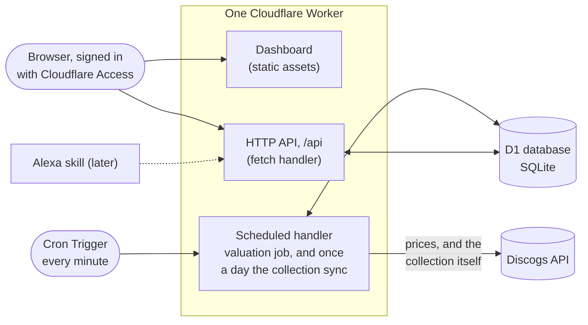

# Vinyl Value Vault

[](https://github.com/JakubMini/vinyl-value-vault/actions/workflows/ci.yml)

A small serverless app that keeps a record of every vinyl I own, asks the market what each one is worth, and always knows what the whole collection is worth. Built on Cloudflare Workers and D1, priced from Discogs, with a React dashboard served by the same Worker, designed to run for free.

> **Status:** live on Cloudflare since 2 October 2026 ([health check](https://vinyl-value-vault.jakub-m-szypicyn.workers.dev/api/health)). My collection, 163 records, is in, and syncs from Discogs daily. Pricing is limited by how often Discogs answers Cloudflare's shared address (see [Designed for the free tier](#designed-for-the-free-tier)). The dashboard is being built in small steps: see the [roadmap](#roadmap).

## What it does

- **Keeps the collection.** Each record is stored once: artist, title, pressing details (label, catalogue number, year, country, format), the condition of the disc and the sleeve, and what I paid for it. Adding a record can be as little as its Discogs release id; the rest is filled in from Discogs.
- **Follows the Discogs collection.** Once a day, or on demand, the vault syncs with my Discogs collection: new records arrive with the grades I gave them there, pressing details and cover art stay current, and records that leave the collection are flagged rather than deleted, so their price history survives.
- **Keeps the prices fresh.** Every minute a scheduled job takes a few records whose price is more than a day old and asks Discogs what they are worth today. Every valuation is kept, so each record and the collection as a whole have a price history.
- **Answers one question quickly.** "What is my collection worth?" is a single query, with the number of records priced, the number still waiting, and when the last price came in.
- **Has a dashboard.** A web app served by the same Worker, behind a Cloudflare Access login. Today it shows what the collection is worth, lists the whole collection in a table that sorts, searches and filters, lets me grade each record in place, and runs or previews a sync with Discogs. Each record has its own page: its price history as a chart and a table, Discogs' price at every grade, and what I paid and when. A chart of the whole collection's value comes next.
- **Exposes a small JSON API** so the dashboard, a script, or a voice assistant can add records and ask about them.

## How it works



One Worker, two entry points. The `fetch` handler serves the API; the `scheduled` handler runs the valuation job, and once a day the collection sync in its place. Both reach the same D1 database through a binding, so there is no connection string, no server to keep alive, and nothing running between requests.

The dashboard is a React app that Vite builds into static files, deployed with the Worker. Cloudflare serves those files without running the Worker at all, so page loads are free and unmetered; only `/api/*` reaches the code. Any other path gets the app's `index.html`, so a link to a page inside the dashboard still works after a reload. One origin for the app and the API means no CORS.

### How a record gets its price

Discogs is the reference market for records and offers two useful numbers for any pressing:

1. **Price suggestions**: what a copy in each condition grade typically sells for. This is the headline value, matched to the grade I recorded for my own copy. It needs an API token and seller settings on the Discogs account.
2. **Marketplace stats**: the cheapest copy listed right now and how many are for sale. Always available, and the fallback when suggestions are not.

Which of the two produced a value is stored with every valuation, so the figures are never mixed up. If nothing is for sale and Discogs has no suggestion, the record keeps its last value and the reason is written on it, visible in the API.

Changing a record's grade re-prices it at once, without calling Discogs: every stored valuation keeps Discogs' suggestions for all eight grades, so the new value is read from the latest one and recorded as a regrade. The record then goes to the front of the queue, and the next run confirms the price with fresh data. When the price came from the cheapest listing, which does not depend on grade, the value stays as it is.

### Staying in step with the Discogs collection

My records are catalogued on Discogs, so that is where the collection lives. The vault syncs with it rather than asking me to enter anything twice.

The rule that keeps this simple is who owns what. **Discogs owns what a pressing is**: artist, title, label, year, format, cover art. **The vault owns what I say about my copy**: its grades, notes and what I paid. A sync adds new items, taking whatever grades Discogs has for them, and refreshes the Discogs-owned details of items already here. It never overwrites a grade or a note set in the vault.

- **Removals are flagged, not deleted.** A record that has left the collection keeps its price history but drops out of the total and the valuation queue. If it comes back, the flag clears.
- **Deleting is deliberate.** A record deleted from the vault is remembered, so the next sync does not bring it back.
- **A bad answer cannot empty the vault.** Removals are only decided after every page has been read. If a sync would flag more than a fifth of the collection, it stops and asks for confirmation.
- **Nothing is written twice.** The sync reads the vault's Discogs-linked records once, works out what is new or changed in memory, and writes each page of up to 100 items in two statements.

### Designed for the free tier

The Workers free plan allows 50 outbound requests and 10 ms of CPU per invocation. Discogs allows 60 requests a minute, counted per source IP.

That second limit turned out to be the real constraint. The first version ran every five minutes and asked for 20 records, about 40 calls at once. In production Discogs cut it off after about a dozen. Workers send requests from IP addresses shared with other Cloudflare customers, so part of each minute's allowance is often already spent by someone else.

The job now works with that rather than against it:

- **Small and frequent.** It runs every minute and prices at most 5 records, so at most 10 calls. Load is spread across the minute instead of bursting.
- **Only what is due.** A record priced in the last 24 hours is skipped. Once the collection is fresh the job makes no Discogs calls at all, and each record costs two calls a day.
- **No wasted calls.** If Discogs says the account cannot get price suggestions, the job stops asking for the rest of the batch and uses listing prices.
- **Polite under pressure.** It reads Discogs' rate-limit headers and stops early instead of being throttled. Whatever it did not reach waits a minute.
- **The sync takes its own minute.** Once a day the cron syncs the collection instead of pricing records: two calls, plus one per 100 items. A sync that fails or is cut short is retried an hour later, so valuations never wait on it for long.

At best that is 7,200 record prices a day, far more than the daily refresh of a personal collection needs. Time spent waiting on Discogs does not count as CPU time, so the 10 ms budget is not a concern.

Expected running cost at this scale: nothing.

## The stack, and why

| Piece | Choice | Why |
| --- | --- | --- |
| Runtime | [Cloudflare Workers](https://developers.cloudflare.com/workers/) | Serverless, globally deployed, generous free tier, and the cron, database and HTTP surface come from one platform. |
| Database | [D1](https://developers.cloudflare.com/d1/) | A hosted SQLite database with migrations and a binding straight into the Worker. Right-sized for a personal collection. |
| Scheduling | [Cron Triggers](https://developers.cloudflare.com/workers/configuration/cron-triggers/) | A line of config, no scheduler to run. |
| Dashboard | [React](https://react.dev/) + [Vite](https://vite.dev/), on [Workers Static Assets](https://developers.cloudflare.com/workers/static-assets/) | One deploy and one origin with the API. Cloudflare's Vite plugin runs the Worker in the real runtime during development, next to the app. [TanStack Query](https://tanstack.com/query) handles fetching and caching; styling is plain CSS with light and dark tokens. Charts are drawn as plain SVG by one small component rather than a charting library. |
| HTTP | [Hono](https://hono.dev/) | A small, fast, well-typed router built for the Workers runtime. |
| Sign-in | [Cloudflare Access](https://developers.cloudflare.com/cloudflare-one/policies/access/) | A login page for the dashboard without writing one, free for a personal project. The Worker verifies Access's signed token itself, so a misconfiguration locks the door rather than opening it. |
| Validation | [Zod](https://zod.dev/) | Every request body and query string is checked before it touches the database. |
| Language | TypeScript, strict | Binding types are generated from the Wrangler config, so a typo in a binding name fails the build, not production. |
| Tests | [Vitest](https://vitest.dev/) with Cloudflare's plugin | Tests run inside the real Workers runtime against a real local D1 with migrations applied. Discogs is mocked at the network layer with [Mock Service Worker](https://mswjs.io/). |
| CI | GitHub Actions | Types, typecheck, tests and a dry-run deploy on every pull request. |

## Data model

Five tables. Money is stored as integers in minor units (pence) so there is no floating-point drift. Times are ISO-8601 UTC strings. Condition uses the Goldmine scale collectors use: M, NM, VG+, VG, G+, G, F, P.

| Table | One row per | Notes |
| --- | --- | --- |
| `records` | record in the collection | Carries the current value and when it was last looked at, so listing and totalling need no joins. Records from Discogs remember their collection item, which is unique, so a sync can never duplicate a record. Also holds cover art URLs and a flag for records that have left the Discogs collection. |
| `valuations` | price fetched for a record | Append-only history, with the method used, the grade the price was for, and the raw Discogs payload for re-deriving later (a regrade does exactly that). |
| `collection_snapshots` | valuation run that changed something | The collection total over time, ready to chart. |
| `sync_runs` | collection sync | What each sync added, refreshed and flagged, and why one stopped early. Also how the cron knows when the next sync is due. |
| `sync_ignored` | record deleted on purpose | Discogs collection items the sync must not bring back. |

The schema is in [`migrations/`](migrations/), one numbered file per change.

## API

Every route lives under `/api`, which leaves the rest of the hostname free for the dashboard. Every route except `/api/health` needs a credential: the API key as `Authorization: Bearer <API_KEY>`, or a Cloudflare Access login (see [Who can get in](#who-can-get-in)). Responses are JSON. Amounts are in minor units, with a formatted string alongside where it helps.

| Method and path | What it does |
| --- | --- |
| `GET /api/health` | Liveness check. No key needed. |
| `GET /api/collection` | Total value, record counts, when the last price arrived, and the last 30 snapshots. |
| `GET /api/records?limit=&offset=` | The collection, alphabetical, up to 1,000 a page. Each record carries its change over 30 days and its gain against what I paid (when both are in the same currency). |
| `POST /api/records` | Add a record. Give a `discogs_release_id` alone, or `artist` and `title`. Priced immediately when it has a Discogs id, unless `?value=false` leaves it to the cron. A repeated `discogs_instance_id` gets a 409. |
| `GET /api/records/:id?limit=` | One record with its price history, newest first (a year by default, up to 1,000 prices), Discogs' suggested price at every grade from the latest price, and a link to the release on Discogs. |
| `PATCH /api/records/:id` | Change any field a client may set. A new media grade re-prices the record from the stored Discogs suggestions and queues it for a fresh price. |
| `DELETE /api/records/:id` | Remove a record and its history. A record from the Discogs collection is remembered, so a sync does not bring it back. |
| `POST /api/records/:id/revalue` | Price one record now. |
| `POST /api/valuations/run?limit=` | Run a valuation batch now. The cron does exactly this. |
| `GET /api/snapshots?limit=` | The collection total over time. |
| `POST /api/sync/discogs` | Sync with the Discogs collection now. `?dry_run=true` reports what would change without writing; `?force_removals=true` confirms a large removal. Answers 502 if Discogs refused. |
| `GET /api/sync/runs?limit=` | Recent syncs, newest first. |

Adding a record by its Discogs id:

```bash
curl -s -X POST http://localhost:8787/api/records \
  -H "Authorization: Bearer $API_KEY" \
  -H "content-type: application/json" \
  -d '{"discogs_release_id": 249504, "media_condition": "VG+", "sleeve_condition": "VG", "purchase_price_minor": 1800, "purchase_currency": "GBP"}'
```

```json
{
  "id": 1,
  "discogs_release_id": 249504,
  "artist": "Nirvana",
  "title": "Nevermind",
  "label": "DGC",
  "catalogue_number": "DGC 24425",
  "year": 1991,
  "format": "LP, Album",
  "media_condition": "VG+",
  "sleeve_condition": "VG",
  "purchase_price_minor": 1800,
  "current_value_minor": 2500,
  "current_currency": "GBP",
  "current_value": "£25.00",
  "last_valued_at": "2026-10-02T09:00:00.000Z",
  "last_valuation_error": null
}
```

## Who can get in

Two kinds of caller, two credentials. Everything except `/api/health` needs one of them.

- **Me, in a browser.** The dashboard sits behind Cloudflare Access. Before a request reaches the Worker, Access asks me to log in, then attaches a signed token to every request. The Worker checks that token itself: the signature against the team's published keys, the issuer, the application it was issued for, and its expiry. A header on its own proves nothing.
- **Scripts and tests.** `Authorization: Bearer <API_KEY>`, compared in constant time. A script calling through Access also sends an Access service token (`CF-Access-Client-Id` and `CF-Access-Client-Secret`).

Setting Access up, once:

1. In the Cloudflare dashboard (the personal account): Workers & Pages → vinyl-value-vault → Settings → Domains & Routes → enable Cloudflare Access, for workers.dev and for Preview URLs. The Zero Trust free plan covers up to 50 users, though signing up asks for a payment method.
2. In Zero Trust → Access → Applications, open the application it created. Limit its policy to my email and copy its Application Audience (AUD) tag.
3. Set `ACCESS_TEAM_DOMAIN` (`https://<team>.cloudflareaccess.com`) and `ACCESS_AUD` in `wrangler.jsonc`, and deploy. While either is empty, the Worker refuses every Access token and only the API key works.
4. For scripts, create a service token under Zero Trust → Access → Service Auth and allow it in the application's policies.

With Access on, `/api/health` is behind the login too.

## Running it locally

You need Node 24 or newer. Nothing else is installed on your machine; the Worker and its database run in a local sandbox.

```bash
npm install
cp .dev.vars.example .dev.vars      # then set API_KEY, and DISCOGS_TOKEN if you have one
echo "VITE_DEV_API_KEY=<the same API_KEY>" > .env.development.local
npm run db:migrate:local
npm run dev
```

The dashboard is at `http://localhost:5173` and the API at `http://localhost:5173/api`. There is no Cloudflare Access locally, so in development the dashboard sends the API key from `.env.development.local`; Vite reads that file only in development, so the key never reaches a production build. The cron handler can be fired by hand:

```bash
curl http://localhost:5173/cdn-cgi/local/scheduled
```

Checks before pushing:

```bash
npm run check      # regenerate binding types, typecheck, run the tests
```

## Syncing the Discogs collection

The cron does this once a day on its own. To sync now, or to preview first:

```bash
curl -s -X POST "https://vinyl-value-vault.jakub-m-szypicyn.workers.dev/api/sync/discogs?dry_run=true" \
  -H "Authorization: Bearer $API_KEY"
curl -s -X POST "https://vinyl-value-vault.jakub-m-szypicyn.workers.dev/api/sync/discogs" \
  -H "Authorization: Bearer $API_KEY"
```

The Worker uses `DISCOGS_TOKEN` to find the Discogs account behind it, pages through its collection, keeps the vinyl, and maps each item to a record: pressing details and cover art from Discogs, condition grades from the collection's Media and Sleeve Condition fields where they are filled in, and the collection's notes. A sleeve marked Generic or No Cover has no grade, so it goes into the notes.

New records arrive without a price. Pricing a few hundred records at once would mean a burst of Discogs calls; instead the cron prices them a few at a time, every minute, until all are done.

## Deploying

This is what the first deploy looked like, on the free plan:

```bash
npx wrangler login
npx wrangler deploy                 # the first run also created the D1 database; its id is pinned in wrangler.jsonc
npm run db:migrate:remote
npx wrangler secret put API_KEY
npx wrangler secret put DISCOGS_TOKEN
```

After that, `npm run deploy` builds the dashboard and the Worker with Vite and ships both. `npx wrangler tail` streams the structured logs, including a summary line from every valuation run and sync.

## How I work on this

- **Nothing lands on `main` directly.** Every change, however small, is a branch and a pull request. CI must pass before merging.
- **Tests run in the real runtime.** The suite spins up the Worker in workerd with a fresh D1, applies the migrations, and exercises the API and the scheduled job end to end. Discogs is mocked at the fetch layer, so the tests are fast, deterministic and never touch the network.
- **Migrations are append-only.** The schema changes by adding numbered files, never by editing one that has been applied.
- **Secrets never enter the repo.** `.dev.vars` locally, `wrangler secret put` in production, and the secret names are typed so a missing one fails closed.
- **This README is kept true.** A change to the architecture, API, setup or roadmap updates it in the same pull request.
- **AI-assisted.** I build this with Claude Code as a pair programmer. The design decisions, reviews and merges are mine.

## Project layout

```
index.html       the dashboard's page; Vite builds it with web/ into static assets
web/             the dashboard: React pages, the API client, styles
public/          files served as they are: icon, security headers
src/
  index.ts       Worker entry: fetch -> the API, scheduled -> the valuation job or the daily sync
  app.ts         HTTP routes, validation, authentication
  access.ts      checking Cloudflare Access sign-in tokens
  valuation.ts   the job: pick stale records, price them, snapshot the total
  sync.ts        the Discogs collection sync: add, refresh, flag what has gone
  discogs.ts     Discogs API client
  release.ts     Discogs release and collection item -> record mapping
  db.ts          every SQL statement, typed
  grades.ts      Goldmine grades and their Discogs labels
  money.ts       minor-unit helpers
  api-types.ts   response shapes shared by the API and the dashboard
migrations/      D1 schema, numbered and append-only
test/            Vitest suites running inside workerd
wrangler.jsonc   Worker config: bindings, vars, cron, static assets
vite.config.ts   one build for the dashboard and the Worker
```

## Roadmap

- [x] Schema, API, valuation job, tests and CI
- [x] First deployment
- [x] Import my actual collection, and keep it in sync with Discogs
- [x] Dashboard, first step: the total, and syncing with Discogs
- [x] Dashboard: the collection table, sorting and grading
- [x] Dashboard: each record's page and price history
- [ ] Dashboard: the collection's value over time, and its biggest risers and fallers
- [ ] Spotify links for every record
- [ ] Alexa skill: "what is my collection worth?"
- [ ] Gain and loss against purchase price, per record and overall

## Licence

No licence yet, all rights reserved. Feel free to read and learn from it; ask before reusing.
