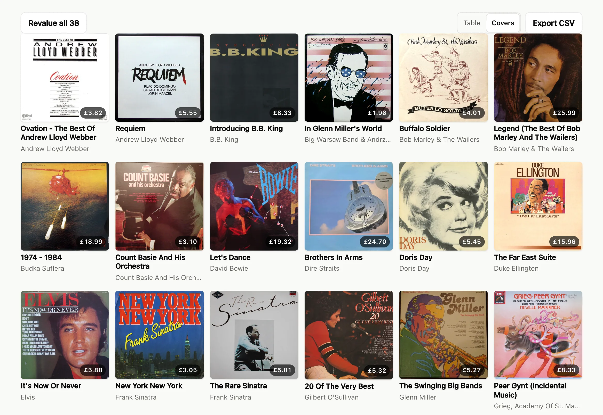
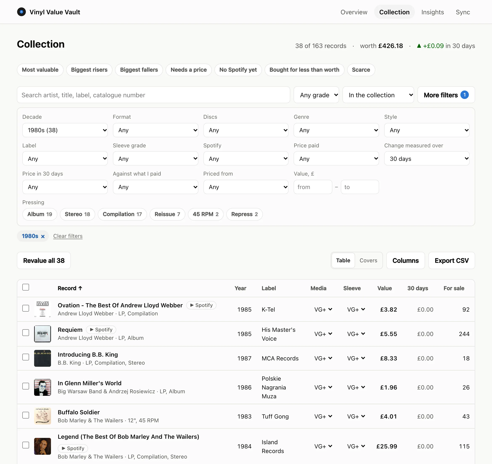
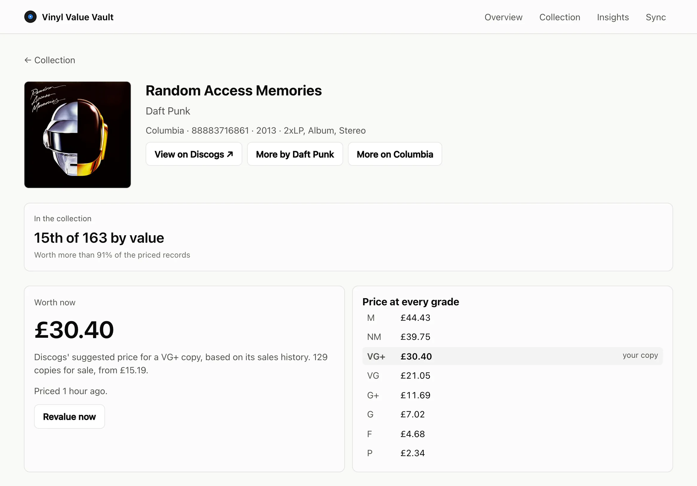
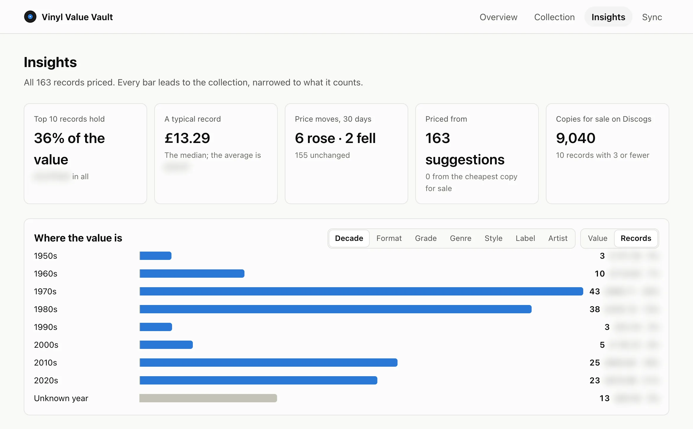
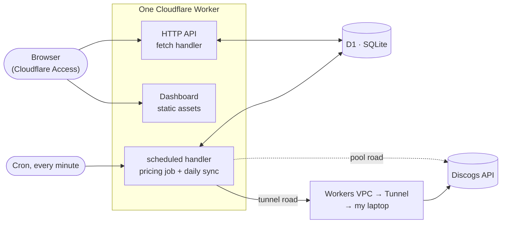

<div align="center">

# Vinyl Value Vault

**Every record I own, what it is worth today, and how that has changed.**

[](https://github.com/JakubMini/vinyl-value-vault/actions/workflows/ci.yml)


</div>

A serverless app that keeps my vinyl collection, prices each record from the Discogs market, and always knows what the whole thing is worth. One Cloudflare Worker, one SQLite database, a React dashboard, nothing to pay.

<picture>
  <source media="(prefers-color-scheme: dark)" srcset="docs/screenshots/covers-dark.webp">
  
</picture>

> [!NOTE]
> **Live since 2 October 2026** at [vault.jakubszypicyn.com](https://vault.jakubszypicyn.com), behind a Cloudflare Access login. 163 records, synced from Discogs daily and priced at Discogs' suggestion for each record's grade. Every record is still on the default grade, VG+, until I grade them.

## What it does

- **Follows my Discogs collection.** A daily sync adds new records, keeps their details current, and flags the ones that leave instead of deleting them.
- **Keeps prices fresh.** A job runs every minute and re-prices anything more than a day old. Every price is kept, so each record and the whole collection have a history.
- **Answers one question fast.** "What is my collection worth?" is a single query.
- **Plays it.** Paste a Spotify album link and the record's page gets a player. No Spotify API involved.
- **Has a small JSON API** for the dashboard, scripts, and later a voice assistant.

**The dashboard**

| Page | What's on it |
| --- | --- |
| Overview | Total value, what price moves did to it (a week to all time), a chart of it over time, biggest risers and fallers. Gain on what I paid, and records waiting for a price, appear only when there are some. |
| Collection | A table or a wall of covers, most valuable first. One toolbar: search, sort, and a drawer of filters (grade, decade, format, genre, label, value and more). Tabs for risers, fallers and a to-do list: no price or no Spotify link yet. Totals follow the filter, and the filter lives in the URL. Pick columns, export CSV, tick records to grade or re-price them together. |
| Record | The value first, with its rank in the collection. Price history beside the cheapest copy for sale, and Discogs' price at my grade and the grades either side (all eight a click away). My copy in one line: grades, what I paid, the yearly gain. One click opens the form to grade it. A compact Spotify player, more by the same artist or label, and re-pricing and deleting in a ⋯ menu. |
| Insights | A row of headline figures, most of them links into the collection. Value by decade, format, grade, genre, style, label or artist; price bands; how the collection grew, once records have joined on more than one day. Built from data the table already loaded, so no extra reads. |
| Sync | Run or preview a Discogs sync, and see the recent ones. A dot in the header, on every page, says how the last one went. |

<table>
  <tr>
    <td width="33%" valign="top">
      <picture>
        <source media="(prefers-color-scheme: dark)" srcset="docs/screenshots/collection-dark.webp">
        
      </picture>
      <p align="center"><b>Collection</b><br><sub>Filters, totals, grading in place</sub></p>
    </td>
    <td width="33%" valign="top">
      <picture>
        <source media="(prefers-color-scheme: dark)" srcset="docs/screenshots/record-dark.webp">
        
      </picture>
      <p align="center"><b>Record</b><br><sub>Rank, value, price at every grade</sub></p>
    </td>
    <td width="33%" valign="top">
      <picture>
        <source media="(prefers-color-scheme: dark)" srcset="docs/screenshots/insights-dark.webp">
        
      </picture>
      <p align="center"><b>Insights</b><br><sub>Where the value sits</sub></p>
    </td>
  </tr>
</table>

<sub>Screenshots of my real collection. The total and the most valuable records are kept out of them, and the figures that would add up to the total are blurred.</sub>

## How it works



- **One Worker, two entry points.** `fetch` serves the API. `scheduled` runs the pricing job, and once a day the Discogs sync in its place.
- **The dashboard is static files.** Cloudflare serves them without running the Worker, so page loads cost nothing. Only `/api/*` reaches code. Same origin, so no CORS.
- **The database is bound straight in.** No connection string, no server to keep alive.

### How a record gets its price

Discogs offers two numbers for any pressing:

1. **A price suggestion for each grade.** The headline value, matched to my copy's grade.
2. **The cheapest copy for sale**, and how many are listed. The fallback.

The cheapest listing is rough: one seller's asking price, for any grade. Before suggestions were switched on, it valued an in-demand record 50% above its median sale and a common one at 10p.

Each valuation stores which method it used and all eight graded suggestions. So **a new grade re-prices instantly**, without calling Discogs, and the next run confirms it. Asking to re-price many records just moves them to the front of the queue: 163 records would be 300+ calls, and a Worker may make 50.

<details>
<summary>Why not eBay, Popsike, or Discogs' sales history?</summary>

- Discogs shows recent sale prices (low, median, high) on its website, behind a login. The API doesn't offer them.
- eBay's sold-price API is for approved developers only. Its open API has asking prices, without Goldmine grades.
- Popsike, MusicStack and CDandLP have no public API.

</details>

### Staying in step with Discogs

One rule keeps the sync simple:

| Discogs owns what a pressing *is* | The vault owns what I say about *my copy* |
| --- | --- |
| Artist, title, label, year, format, genres, styles, cover art | Grades, notes, what I paid, its Spotify album |

A sync adds new records, with whatever grades Discogs has for them, and refreshes the Discogs side of existing ones. It never overwrites anything on the vault's side.

- **Removals are flagged, not deleted.** The price history survives, and the flag clears if the record comes back.
- **Deletes are remembered**, so a sync never brings a record back.
- **A bad response can't empty the vault.** Removals are decided only after every page is read. A sync that would flag more than a fifth of the collection stops and asks.

### Built for the free tier

| Limit | Budget | How the vault stays inside it |
| --- | --- | --- |
| Worker subrequests | 50 per run | 15 records per run: 3 calls for the run, 3 per record = 48 |
| Worker CPU | 10 ms per run | Waiting on Discogs is not CPU time |
| Discogs | 60 calls a minute, per address | At most 30 a minute; reads the rate-limit headers and stops early |
| D1 reads | 5 million rows a day | About 3 rows per record for the list; the chart reads a small daily table |

Anything priced in the last 24 hours is skipped, so a fresh collection costs no Discogs calls at all. A full re-price takes about 11 minutes. The daily sync takes its own run: 2 calls, plus one per 100 records.

### The road to Discogs

> [!IMPORTANT]
> When a Worker calls a site that also sits behind Cloudflare, the site sees one fixed address, `2a06:98c0:3600::103`, shared by **every Worker of every Cloudflare customer**. Discogs rate-limits by address, so the vault was sharing 60 calls a minute with everyone. On 2 October 2026 most minutes got a 429 on the first call.

The fix is to call Discogs from an address of my own. One setting, `DISCOGS_ROAD`, picks the road:

| Road | Calls leave through | Discogs sees | Runs | Records per run |
| --- | --- | --- | --- | --- |
| `tunnel` | Workers VPC → Cloudflare Tunnel → `cloudflared` on my laptop | My home address | Every minute | 15 |
| `pool` *(default)* | A plain `fetch` | The shared address | Every 5 minutes | 5 |

The laptop only needs to be awake about 11 minutes a day. While it sleeps, calls fail at once; the job treats that as "try again next minute" and blames no record.

```bash
npm run egress:here     # make this machine the way out (tunnel road)
npm run egress:pool     # back to the shared address
npm run egress:status   # which road, which machines are connected
npm run egress:remove   # stop this machine being the way out
```

Each one checks first that wrangler is logged in to the vault's Cloudflare account.

<details>
<summary>What <code>egress:here</code> does, and moving to a new laptop</summary>

- Installs `cloudflared` with Homebrew if needed.
- Fetches the tunnel's connector token and keeps it in `~/Library/Application Support/vinyl-value-vault/`, readable only by me.
- Runs `cloudflared` as a launchd agent, so it starts at login and restarts if it stops. Log: `~/Library/Logs/vinyl-value-vault-egress.log`.
- Sets `DISCOGS_ROAD=tunnel` and watches the next run go through.

`DISCOGS_ROAD` is stored as a Worker secret. It isn't secret, but secrets survive deploys, so a deploy can't flip the road back.

**New laptop:** clone, `npm install`, `npx wrangler login`, `npm run egress:here`. Then `npm run egress:remove` on the old one. While both are connected, calls are split between two addresses, and `egress:here` warns about it.

**What the laptop can see:** `cloudflared` makes the HTTPS connection to Discogs, so it sees the requests, token included. Fine on my own laptop, and why the connector token stays private.

</details>

<details>
<summary>Setting up the road from scratch, and replacing a lost token</summary>

Done once, on 2 October 2026:

```bash
npx wrangler tunnel create vinyl-vault-egress
npx wrangler vpc service create discogs-api --type http --tunnel-id <tunnel id> --hostname api.discogs.com
# put the service id in wrangler.jsonc (vpc_services, binding DISCOGS_EGRESS), deploy, then:
npm run egress:here
```

If a laptop holding the token is lost, recreate the tunnel and repoint the service. The service id stays the same, so `wrangler.jsonc` doesn't change.

```bash
npx wrangler tunnel delete vinyl-vault-egress
npx wrangler tunnel create vinyl-vault-egress
npx wrangler vpc service update <service id> --name discogs-api --type http --tunnel-id <new tunnel id> --hostname api.discogs.com
npm run egress:here
```

</details>

<details>
<summary>Other ways out, and why not</summary>

- **Cloudflare Gateway egress** gets past the shared address, but each call leaves from a different one. Discogs couldn't count the vault as one client, and its terms warn against getting around the limit.
- **GitHub Actions** is free on a public repo, but GitHub's terms rule out using it as part of a running service.
- **A free cloud VM** could replace the laptop. Oracle's Always Free VM is the only one free with no end date and its own address, but it needs a card and idle VMs get reclaimed.

</details>

## Stack

| | Choice | Why |
| --- | --- | --- |
| Runtime | [Cloudflare Workers](https://developers.cloudflare.com/workers/) | Serverless, free tier, and cron, database and HTTP from one platform. |
| Database | [D1](https://developers.cloudflare.com/d1/) | Hosted SQLite with migrations, bound straight into the Worker. Right-sized for one collection. |
| Scheduling | [Cron Triggers](https://developers.cloudflare.com/workers/configuration/cron-triggers/) | One line of config, no scheduler to run. |
| Way out | [Tunnel](https://developers.cloudflare.com/tunnel/) + [Workers VPC](https://developers.cloudflare.com/workers-vpc/) *(beta)* | Discogs calls leave from my address, with nothing on the laptop open to the internet. |
| HTTP | [Hono](https://hono.dev/) | Small, fast, well typed, made for Workers. |
| Validation | [Zod](https://zod.dev/) | Every body and query string is checked before it touches the database. |
| Dashboard | [React](https://react.dev/) + [Vite](https://vite.dev/) + [TanStack Query](https://tanstack.com/query) | One deploy, one origin with the API. Plain CSS; charts are hand-drawn SVG, no chart library. |
| Sign-in | [Cloudflare Access](https://developers.cloudflare.com/cloudflare-one/policies/access/) | A login page without writing one. The Worker checks the token itself, so a misconfiguration locks the door. |
| Tests | [Vitest](https://vitest.dev/) in workerd + [MSW](https://mswjs.io/) | The real runtime and a real local D1; Discogs mocked at the network layer. |
| CI | GitHub Actions | Types, typecheck, tests and a dry-run deploy on every pull request. |

## Data model

Money is stored in pence as integers. Times are ISO-8601 UTC. Grades use the Goldmine scale: M, NM, VG+, VG, G+, G, F, P.

| Table | One row per | Notes |
| --- | --- | --- |
| `records` | Record | The current value, how it was found and the market behind it, rolled up so lists and totals need no joins. Also Discogs details, genres and styles, the Spotify album, and a flag for records that left Discogs. |
| `valuations` | Price fetched | Append-only, with the method, the grade, and the raw Discogs payload for re-deriving later. |
| `collection_snapshots` | Run that changed something | The collection total after each run. |
| `collection_daily` | Day | The day's last total. What the chart reads. |
| `sync_runs` | Sync | What each sync added, refreshed and flagged, and why one stopped. |
| `sync_ignored` | Deliberate delete | Items the sync must not bring back. |

The schema lives in [`migrations/`](migrations/), one numbered file per change.

## API

Everything lives under `/api`. Every route except `/api/health` needs `Authorization: Bearer <API_KEY>` or an Access login. Amounts are in pence, with a formatted string alongside where it helps.

| Route | Does |
| --- | --- |
| `GET /api/health` | Liveness. No key needed. |
| `GET /api/collection?days=` | Total value, counts, when the last price came in, and a total per day (30 days by default). |
| `GET /api/records?limit=&offset=&change_days=` | The collection, A–Z, with change over a window, gain on cost, and how each price was found. |
| `POST /api/records` | Add by `discogs_release_id`, or `artist` and `title`. Priced at once unless `?value=false`. |
| `GET /api/records/:id?limit=` | One record, its price history, and Discogs' price at every grade. |
| `PATCH /api/records/:id` | Edit. A new grade re-prices from stored suggestions. Takes a Spotify link, URI or id. |
| `DELETE /api/records/:id` | Remove it, and keep the sync from bringing it back. |
| `POST /api/records/:id/revalue` | Price one record now. |
| `POST /api/valuations/run?limit=` | Run a pricing batch now, as the cron does. |
| `POST /api/valuations/queue` | Move `{"ids": [...]}` to the front of the queue. |
| `GET /api/snapshots?limit=` | The collection total over time. |
| `POST /api/sync/discogs` | Sync now. `?dry_run=true` previews; `?force_removals=true` confirms a large removal. |
| `GET /api/sync/runs?limit=` | Recent syncs. |

<details>
<summary>Example: add a record by its Discogs id</summary>

```bash
curl -s -X POST http://localhost:5173/api/records \
  -H "Authorization: Bearer $API_KEY" \
  -H "content-type: application/json" \
  -d '{"discogs_release_id": 249504, "media_condition": "VG+", "sleeve_condition": "VG", "purchase_price_minor": 1800, "purchase_currency": "GBP"}'
```

```json
{
  "id": 1,
  "discogs_release_id": 249504,
  "artist": "Nirvana",
  "title": "Nevermind",
  "label": "DGC",
  "catalogue_number": "DGC 24425",
  "year": 1991,
  "format": "LP, Album",
  "genres": ["Rock"],
  "styles": ["Grunge", "Alternative Rock"],
  "media_condition": "VG+",
  "sleeve_condition": "VG",
  "purchase_price_minor": 1800,
  "current_value_minor": 2500,
  "current_currency": "GBP",
  "current_value": "£25.00",
  "current_method": "price_suggestion",
  "current_lowest_listing_minor": 1850,
  "current_num_for_sale": 42,
  "last_valued_at": "2026-10-02T09:00:00.000Z",
  "last_valuation_error": null
}
```

</details>

## Who can get in

- **Me, in a browser.** Cloudflare Access asks me to log in, then signs every request. The Worker verifies the token itself: signature, issuer, audience and expiry. A header alone proves nothing.
- **Scripts and tests.** The API key, compared in constant time. In production a script also needs an Access service token, because every path, `/api/health` included, is behind the login.

<details>
<summary>Setting up Access, and calling production from a script</summary>

1. In the Cloudflare dashboard: Workers & Pages → vinyl-value-vault → Settings → Domains & Routes → enable Cloudflare Access for workers.dev and Preview URLs. The Zero Trust free plan covers 50 users, though sign-up asks for a payment method.
2. In Zero Trust → Access → Applications, open the new application. Its policy lets in members of my Cloudflare account. Copy its Application Audience (AUD) tag.
3. Set `ACCESS_TEAM_DOMAIN` and `ACCESS_AUD` in `wrangler.jsonc` and deploy. While either is empty, the Worker refuses every Access token and only the API key works.
4. For scripts, create a service token under Access → Service Auth and allow it in the application's policies.
5. Nothing to add for the custom domain. The application protects the Worker itself (an Access destination of type `worker`), not a list of hostnames, so `vault.jakubszypicyn.com` is covered the moment it exists, with the same audience tag. A separate application for it would issue tokens the Worker refuses.

Then, for example, a dry-run sync:

```bash
curl -s -X POST "https://vault.jakubszypicyn.com/api/sync/discogs?dry_run=true" \
  -H "CF-Access-Client-Id: $CF_ACCESS_CLIENT_ID" \
  -H "CF-Access-Client-Secret: $CF_ACCESS_CLIENT_SECRET"
```

</details>

## Run it locally

Needs Node 24 or newer. The Worker and its database run in a local sandbox.

```bash
npm install
cp .dev.vars.example .dev.vars                            # set API_KEY, and DISCOGS_TOKEN if you have one
echo "VITE_DEV_API_KEY=<same API_KEY>" > .env.development.local
npm run db:migrate:local
npm run dev                                               # http://localhost:5173
```

There is no Access locally, so the dev dashboard sends the API key instead. Vite only reads that file in development, so the key never reaches a build. Locally the vault takes the pool road, which from your machine means your own address.

> [!TIP]
> Fire the cron by hand with `curl http://localhost:5173/cdn-cgi/local/scheduled`.

Before pushing, `npm run check` regenerates binding types, typechecks and runs the tests.

## Deploy

```bash
npm run deploy        # build the dashboard and the Worker, ship both
npx wrangler tail     # stream the structured logs, one summary line per run
```

The vault answers at `vault.jakubszypicyn.com`, a Workers Custom Domain declared in `wrangler.jsonc`: the deploy creates its DNS record and certificate. The domain is registered with Cloudflare on the same account. The old `workers.dev` address stays on, behind the same login, for scripts and the Alexa skill.

<details>
<summary>The first deploy</summary>

```bash
npx wrangler login
npx wrangler deploy                 # also created the D1 database; its id is pinned in wrangler.jsonc
npm run db:migrate:remote
npx wrangler secret put API_KEY
npx wrangler secret put DISCOGS_TOKEN
```

The tunnel road came later: see [The road to Discogs](#the-road-to-discogs).

</details>

## How I work on this

- **Nothing lands on `main` directly.** Every change is a branch and a pull request, and CI must pass.
- **Tests run in the real runtime.** Each suite boots the Worker in workerd with a fresh D1 and exercises the API and the job end to end. No test touches the network.
- **Migrations are append-only.** Never edit one that has been applied.
- **Secrets never enter the repo**, and their names are typed, so a missing one fails closed.
- **This README stays true.** A change to the architecture, API, setup or roadmap updates it in the same PR.
- **AI-assisted.** I build this with Claude Code as a pair programmer. The design decisions, reviews and merges are mine.

<details>
<summary>Project layout</summary>

```
index.html       the dashboard's page; Vite builds it with web/
web/             the dashboard: React pages, API client, styles
public/          served as-is: icon, security headers
docs/screenshots the images in this README, light and dark
src/
  index.ts       Worker entry: fetch → API, scheduled → pricing job or daily sync
  app.ts         routes, validation, authentication
  access.ts      Cloudflare Access token checks
  valuation.ts   the pricing job, and the road to Discogs
  sync.ts        the Discogs collection sync
  discogs.ts     Discogs API client
  release.ts     Discogs release → record mapping
  db.ts          every SQL statement, typed
  select.ts      search, filters and sort (shared with the dashboard)
  insights.ts    the collection cut different ways (shared)
  csv.ts         CSV export (shared)
  spotify.ts     Spotify album links (shared)
  grades.ts      Goldmine grades
  money.ts       minor-unit helpers
  api-types.ts   response shapes shared with the dashboard
scripts/
  egress.ts      manages the road to Discogs
migrations/      D1 schema, numbered, append-only
test/            Vitest suites running in workerd
wrangler.jsonc   Worker config: bindings, vars, cron, static assets
vite.config.ts   one build for the dashboard and the Worker
```

</details>

## Roadmap

**Next**

- [ ] Alexa skill: "what is my collection worth?"
- [ ] Sold prices from Discogs' sales history, entered by hand, if the suggestions prove off

<details>
<summary>Done</summary>

- [x] Schema, API, pricing job, tests and CI
- [x] Deployed, with my collection in and synced daily from Discogs
- [x] Dashboard: total, value over time, risers and fallers
- [x] Collection table: sorting, filters, tabs, totals, grading ticked records together
- [x] Record page: price history, rank, yearly gain, cheapest listing beside the value
- [x] Gain and loss against purchase price
- [x] Market signals: copies for sale, cheapest listing, how each price was found
- [x] Insights page
- [x] Price change over any window
- [x] Genres and styles from Discogs
- [x] Spotify links
- [x] Choose columns, export CSV
- [x] A wall of covers

</details>

<details>
<summary>Looked at and set aside</summary>

- **A sparkline in every row.** Too many database reads for a glance.
- **Discogs' "have" and "want" counts.** A third call per record would cut a run from 15 records to 12. Maybe monthly, later.
- **Country of pressing.** Not in the collection payload; a full release fetch per record would be the price.
- **Coloured vinyl.** Discogs keeps colour in free text. A small change, waiting for a reason.
- **Search over the API**, for the Alexa skill. The logic is already shared in `src/select.ts`, so it's little code when needed.

</details>

## Licence

No licence yet, all rights reserved. Read and learn from it freely; ask before reusing.
